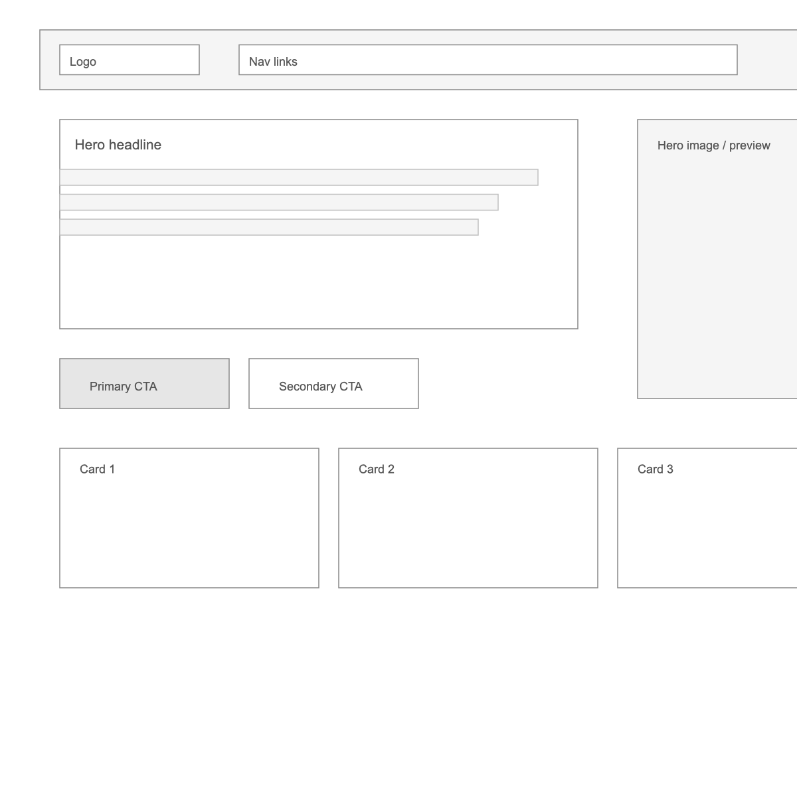

# M1C2 UI/UX Assignment

## Task One: Low-fidelity wireframe

Referencia basada en la imagen proporcionada. Aqui esta el wireframe de baja fidelidad (captura):

Archivo fuente en vector: `task1-wireframe.svg`

## Task Two: Color scheme (timmyomahony.com)

Colores identificados (usados repetidamente en fondo, texto y acentos):

- Beige de fondo: `rgb(240, 240, 232)` / `#F0F0E8`
- Negro para texto y bordes: `rgb(0, 0, 0)` / `#000000`
- Rojo rubi para acentos y enlaces: `rgb(234, 80, 56)` / `#EA5038`

## Task Three: User story (Google)

Como usuario que necesita encontrar informacion rapidamente, quiero un buscador simple con autocompletado y resultados claros, para obtener respuestas en segundos sin distracciones.

## Task Four: Prime objective

- Facebook: conectar personas y comunidades para compartir contenido y mantenerse en contacto.
- Twitter (X): distribuir informacion y conversaciones en tiempo real.
- Google: permitir encontrar informacion relevante en la web de forma rapida.
- YouTube: permitir consumir y descubrir contenido de video de manera facil.
